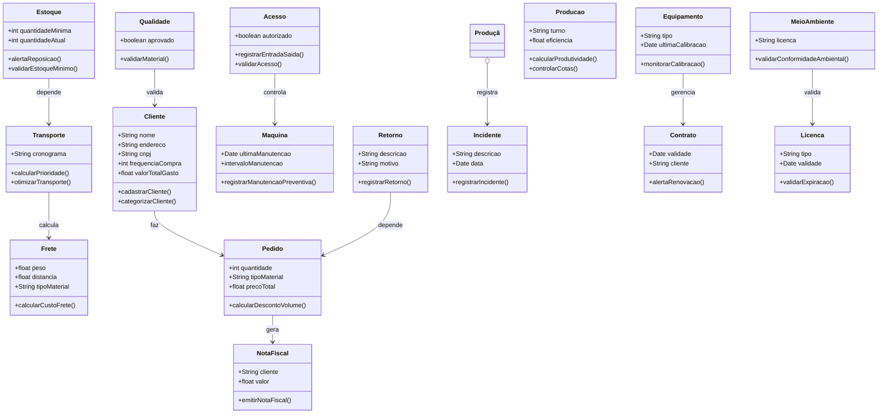
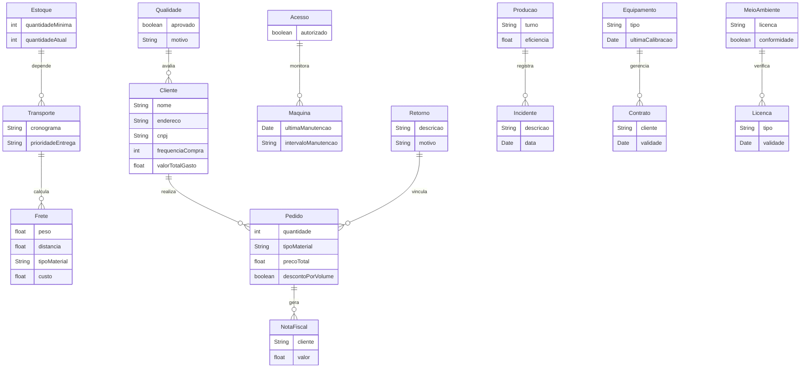

# Vinicius-FreitasAula-ENGENHARIA-DE-SOFTWARE
Unemat
- [Vinicius-FreitasAula-ENGENHARIA-DE-SOFTWARE](#vinicius-freitasaula-engenharia-de-software)
- [1 Introdução](#1-introdução)
- [2 Descrição](#2-descrição)
  - [2.1. Requisitos](#21-requisitos)
- [2.2. Funcionais e não funcionais](#22-funcionais-e-não-funcionais)
- [3 Diagramas](#3-diagramas)
  - [3.1 Diagrama de classe](#31-diagrama-de-classe)
    - [Diagrama feito no white star (versão 1)](#diagrama-feito-no-white-star-versão-1)
    - [Diagrama gerado pelo GPT](#diagrama-gerado-pelo-gpt)
- [3.1.1. Descrição do diagrama de classe](#311-descrição-do-diagrama-de-classe)
- [3.2 Diagrama de casos de uso](#32-diagrama-de-casos-de-uso)
- [3.3 Diagrama de atividade](#33-diagrama-de-atividade)
- [3.4 Diagrama de componentes](#34-diagrama-de-componentes)
- [3.5 Diagrama de implementação](#35-diagrama-de-implementação)
- [4 Histórias de usuarios](#4-histórias-de-usuarios)
- [5 Protótipo de telas](#5-protótipo-de-telas)
- [6 Diagrama de navegação de tela](#6-diagrama-de-navegação-de-tela)
  - [Anexos](#anexos)
    - [A.1. Script SQL](#a1-script-sql)
    - [A.2. Dado artificiais para testes de banco](#a2-dado-artificiais-para-testes-de-banco)

# 1 Introdução
Projeto de engenharia de software para gestão de uma pedreira.

# 2 Descrição
## 2.1. Requisitos

| ID | 								REQUISITO								|
|----|----------------------------------------------------------------------------------------------------------------------------------|
| 1 |  Classificação de clientes: os clientes devem ser categorizados por frequência de compras e valor total gasto.			|
| 2 |  Validação de estoque mínimo: alerta para reposição quando o estoque atingir o limite mínimo definido				|
| 3 |  Prioridade de entrega: as ordens de transporte devem seguir um cronograma baseado em urgência e distância			|
| 4 |  Controle de acesso: apenas funcionários autorizados podem registrar entrada e saída de materiais					|
| 5 |  Registro de manutenção preventiva: as máquinas devem ser mantidas dentro dos intervalos pré-definidos				|
| 6 |  Cálculo automático de frete: o sistema deve calcular o custo do frete de acordo com peso, distância e tipo de material		|
| 7 |  Descontos por volume: compras acima de um limite estabelecido recebem desconto automático					|
| 8 |  Controle de transporte compartilhado: transporte pode ser otimizado para várias entregas próximas				|
| 9 |  Validação de conformidade ambiental: antes de iniciar uma atividade, o sistema verifica licenças ambientais			|
| 10 |  Controle de retorno de materiais: rastreamento de materiais devolvidos ou não aceitos pelos clientes				|
| 11 |  Cálculo de produtividade: determinar a eficiência de cada turno ou setor							|
| 12 |  Bloqueio de vendas para inadimplentes: clientes com pagamento pendente não podem realizar novas compras				|
| 13 |  Registro de incidentes: registro obrigatório de falhas ou acidentes na operação							|
| 14 |  Gestão de contratos: alerta para renovação de contratos prestes a expirar							|
| 15 |  Calibração de equipamentos: monitoramento de prazos para recalibração de máquinas e ferramentas					|
| 16 |  Cálculo de custo total por material: considera mineração, transporte e armazenamento						|
| 17 |  Restrição de acesso ao sistema: níveis de permissão definidos conforme funções dos usuários					|
| 18 |  Controle de cotas de produção: limites diários para extração baseados em demandas e regulamentações				|
| 19 |  Emissão automática de nota fiscal: após a confirmação do pagamento, gerar a nota fiscal automaticamente				|
| 20 |  Previsão de demanda: projeção baseada em históricos de vendas e tendências.							|
| 21 |  Notificação de transporte: aviso automático ao cliente sobre status da entrega.							|
| 22 |  Registro de horário de trabalho: controle automático de horas extras e faltas.							|
| 23 |  Controle de licenças: o sistema deve alertar sobre a expiração de licenças operacionais.					|
| 24 |  Validação de qualidade: rejeitar materiais que não atendem aos critérios estabelecidos.						|
| 25 |  Gerenciamento de fornecedores: avaliação contínua dos fornecedores baseada em entrega, qualidade e preço.			|

# 2.2. Funcionais e não funcionais

> [!TIP]
> Faça uma tabela usando Markdown, com duas colunas, uma indicando os requisitos e a outra coluna indicando o tipo de  requisito (como "funcional" ou "não funcion      al"), para esta tarefa use a lista abaixo.

| Requisito                                         | Tipo de Requisito  |
|---------------------------------------------------|--------------------|
| Classificação de clientes                        | Funcional          |
| Validação de estoque mínimo                      | Funcional          |
| Prioridade de entrega                            | Funcional          |
| Controle de acesso                               | Não funcional      |
| Registro de manutenção preventiva                | Funcional          |
| Cálculo automático de frete                      | Funcional          |
| Descontos por volume                             | Funcional          |
| Controle de transporte compartilhado             | Funcional          |
| Validação de conformidade ambiental              | Não funcional      |
| Controle de retorno de materiais                 | Funcional          |
| Cálculo de produtividade                         | Funcional          |
| Bloqueio de vendas para inadimplentes            | Funcional          |
| Registro de incidentes                           | Funcional          |
| Gestão de contratos                              | Funcional          |
| Calibração de equipamentos                       | Funcional          |
| Cálculo de custo total por material              | Funcional          |
| Restrição de acesso ao sistema                   | Não funcional      |
| Controle de cotas de produção                    | Funcional          |
| Emissão automática de nota fiscal                | Funcional          |
| Previsão de demanda                              | Funcional          |
| Notificação de transporte                        | Funcional          |
| Registro de horário de trabalho                  | Funcional          |
| Controle de licenças                             | Não funcional      |
| Validação de qualidade                           | Funcional          |
| Gerenciamento de fornecedores                    | Funcional          |

# 3 Diagramas

## 3.1 Diagrama de classe

### Diagrama feito no white star (versão 1)

### Diagrama gerado pelo GPT
>[!TIP]
> Faça um diagrama de classe usando Markdown e Mermaid, para os requisitos abaixo

# 3.1.1. Descrição do diagrama de classe

Esse diagrama de classes representa um sistema de gestão de pedreira, incluindo as principais entidades e suas relações. Aqui está uma descrição detalhada:

Classes principais:

Cliente: Representa os clientes do sistema, contendo informações como nome, endereço, CNPJ, frequência de compras e valor total gasto. Também possui métodos para cadastro e categorização dos clientes.

Estoque: Focado no controle da quantidade de materiais disponíveis, alertando sobre o estoque mínimo e realizando a validação de reposição.

Transporte: Organiza os cronogramas de transporte, calcula prioridades e otimiza as rotas.

Acesso: Define quem pode registrar entrada e saída de materiais, validando permissões.

Máquina: Controla os prazos de manutenção preventiva e registra serviços realizados.

Frete: Relacionado ao cálculo do custo com base no peso, distância e tipo de material.

Pedido: Gerencia as transações feitas pelos clientes, como quantidade e tipo de material, além de aplicar descontos por volume.

MeioAmbiente: Verifica licenças e valida a conformidade ambiental para as operações da pedreira.

Retorno: Lida com rastreamento de materiais devolvidos ou rejeitados, registrando motivos.

Incidente: Centraliza o registro de falhas ou acidentes na operação.

Contrato: Gera alertas para renovação de contratos e gerencia suas informações.

Equipamento: Acompanha o estado dos equipamentos, incluindo prazos de calibração.

Produção: Mede a produtividade de turnos e controla cotas de produção diárias.

NotaFiscal: Responsável pela emissão de notas fiscais para os clientes após a conclusão de pedidos.

Licença: Garante que as operações estejam em conformidade com prazos de vencimento de licenças.

Qualidade: Valida os materiais conforme critérios estabelecidos.

Relacionamentos:

A classe Cliente está associada à classe Pedido, representando o vínculo entre clientes e suas compras.

Estoque depende de Transporte para gerenciar a logística de materiais.

Transporte se relaciona com Frete, utilizando os cálculos de custo.

Acesso monitora o uso das Máquinas, garantindo segurança e registro adequado.

MeioAmbiente verifica licenças usando a classe Licença.

Pedido gera a NotaFiscal após a conclusão da venda.

Produção monitora incidentes registrados na classe Incidente.

Equipamento possui relação com a classe Contrato, garantindo a manutenção conforme acordado.

Qualidade valida os materiais fornecidos pelos Clientes.

# 3.2 Diagrama de casos de uso

>[!TIP]
> Faça um diagrama de Entidade Relacionamento usando Markdown e Mermaid, para os requisitos a baixo

# 3.3 Diagrama de atividade

# 3.4 Diagrama de componentes

# 3.5 Diagrama de implementação

# 4 Histórias de usuarios

# 5 Protótipo de telas

# 6 Diagrama de navegação de tela

## Anexos

### A.1. Script SQL

>[!TIP]
> Faça um Script SQL para MySQL, para o diagrama Mermaid acima

´´´SQL

-- Tabela Cliente
CREATE TABLE Cliente (
    id INT AUTO_INCREMENT PRIMARY KEY,
    nome VARCHAR(100) NOT NULL,
    endereco VARCHAR(255),
    cnpj VARCHAR(20),
    frequenciaCompra INT,
    valorTotalGasto DECIMAL(10,2)
);

-- Tabela Estoque
CREATE TABLE Estoque (
    id INT AUTO_INCREMENT PRIMARY KEY,
    quantidadeMinima INT NOT NULL,
    quantidadeAtual INT NOT NULL
);

-- Tabela Transporte
CREATE TABLE Transporte (
    id INT AUTO_INCREMENT PRIMARY KEY,
    cronograma VARCHAR(255),
    prioridadeEntrega VARCHAR(50)
);

-- Tabela Acesso
CREATE TABLE Acesso (
    id INT AUTO_INCREMENT PRIMARY KEY,
    autorizado BOOLEAN NOT NULL
);

-- Tabela Maquina
CREATE TABLE Maquina (
    id INT AUTO_INCREMENT PRIMARY KEY,
    ultimaManutencao DATE,
    intervaloManutencao VARCHAR(50)
);

-- Tabela Frete
CREATE TABLE Frete (
    id INT AUTO_INCREMENT PRIMARY KEY,
    peso DECIMAL(10,2),
    distancia DECIMAL(10,2),
    tipoMaterial VARCHAR(100),
    custo DECIMAL(10,2)
);

-- Tabela Pedido
CREATE TABLE Pedido (
    id INT AUTO_INCREMENT PRIMARY KEY,
    clienteId INT,
    quantidade INT NOT NULL,
    tipoMaterial VARCHAR(100),
    precoTotal DECIMAL(10,2),
    descontoPorVolume BOOLEAN,
    FOREIGN KEY (clienteId) REFERENCES Cliente(id)
);

-- Tabela MeioAmbiente
CREATE TABLE MeioAmbiente (
    id INT AUTO_INCREMENT PRIMARY KEY,
    licenca VARCHAR(100),
    conformidade BOOLEAN NOT NULL
);

-- Tabela Retorno
CREATE TABLE Retorno (
    id INT AUTO_INCREMENT PRIMARY KEY,
    descricao VARCHAR(255),
    motivo VARCHAR(255)
);

-- Tabela Incidente
CREATE TABLE Incidente (
    id INT AUTO_INCREMENT PRIMARY KEY,
    descricao VARCHAR(255),
    data DATE NOT NULL
);

-- Tabela Contrato
CREATE TABLE Contrato (
    id INT AUTO_INCREMENT PRIMARY KEY,
    clienteId INT,
    validade DATE NOT NULL,
    FOREIGN KEY (clienteId) REFERENCES Cliente(id)
);

-- Tabela Equipamento
CREATE TABLE Equipamento (
    id INT AUTO_INCREMENT PRIMARY KEY,
    tipo VARCHAR(100),
    ultimaCalibracao DATE
);

-- Tabela Producao
CREATE TABLE Producao (
    id INT AUTO_INCREMENT PRIMARY KEY,
    turno VARCHAR(50),
    eficiencia DECIMAL(5,2)
);

-- Tabela NotaFiscal
CREATE TABLE NotaFiscal (
    id INT AUTO_INCREMENT PRIMARY KEY,
    clienteId INT,
    valor DECIMAL(10,2),
    FOREIGN KEY (clienteId) REFERENCES Cliente(id)
);

-- Tabela Licenca
CREATE TABLE Licenca (
    id INT AUTO_INCREMENT PRIMARY KEY,
    tipo VARCHAR(100),
    validade DATE NOT NULL
);

-- Tabela Qualidade
CREATE TABLE Qualidade (
    id INT AUTO_INCREMENT PRIMARY KEY,
    aprovado BOOLEAN NOT NULL,
    motivo VARCHAR(255)
);

´´´

### A.2. Dado artificiais para testes de banco

>[!TIP]
> Faça um scritp SQL para MySQL, usando os comandos create anteriores, para popular as tabelas da banco com pelo menos 5 registros ficticios.

´´´

-- Populando a tabela Cliente
INSERT INTO Cliente (nome, endereco, cnpj, frequenciaCompra, valorTotalGasto)
VALUES
('Empresa Alpha', 'Rua A, 123', '12.345.678/0001-00', 20, 50000.00),
('Empresa Beta', 'Rua B, 456', '98.765.432/0001-00', 10, 25000.00),
('Empresa Gamma', 'Rua C, 789', '11.111.111/0001-11', 15, 40000.00),
('Empresa Delta', 'Rua D, 321', '22.222.222/0001-22', 8, 18000.00),
('Empresa Epsilon', 'Rua E, 654', '33.333.333/0001-33', 12, 35000.00);

-- Populando a tabela Estoque
INSERT INTO Estoque (quantidadeMinima, quantidadeAtual)
VALUES
(100, 500),
(200, 400),
(150, 300),
(120, 250),
(80, 600);

-- Populando a tabela Transporte
INSERT INTO Transporte (cronograma, prioridadeEntrega)
VALUES
('Manhã', 'Alta'),
('Tarde', 'Média'),
('Noite', 'Baixa'),
('Manhã', 'Média'),
('Tarde', 'Alta');

-- Populando a tabela Acesso
INSERT INTO Acesso (autorizado)
VALUES
(TRUE),
(FALSE),
(TRUE),
(FALSE),
(TRUE);

-- Populando a tabela Maquina
INSERT INTO Maquina (ultimaManutencao, intervaloManutencao)
VALUES
('2025-01-15', 'Mensal'),
('2025-02-01', 'Bimestral'),
('2025-01-20', 'Mensal'),
('2025-03-10', 'Mensal'),
('2025-01-25', 'Trimestral');

-- Populando a tabela Frete
INSERT INTO Frete (peso, distancia, tipoMaterial, custo)
VALUES
(1000.50, 150.00, 'Brita', 2000.00),
(500.75, 75.00, 'Areia', 1000.00),
(800.30, 100.00, 'Pedra', 1600.00),
(700.25, 120.00, 'Brita', 1400.00),
(900.40, 180.00, 'Areia', 2200.00);

-- Populando a tabela Pedido
INSERT INTO Pedido (clienteId, quantidade, tipoMaterial, precoTotal, descontoPorVolume)
VALUES
(1, 100, 'Brita', 5000.00, TRUE),
(2, 50, 'Areia', 2500.00, FALSE),
(3, 80, 'Pedra', 4000.00, TRUE),
(4, 60, 'Brita', 3000.00, FALSE),
(5, 70, 'Areia', 3500.00, TRUE);

-- Populando a tabela MeioAmbiente
INSERT INTO MeioAmbiente (licenca, conformidade)
VALUES
('Licença Ambiental A', TRUE),
('Licença Ambiental B', TRUE),
('Licença Ambiental C', FALSE),
('Licença Ambiental D', TRUE),
('Licença Ambiental E', TRUE);

-- Populando a tabela Retorno
INSERT INTO Retorno (descricao, motivo)
VALUES
('Material rejeitado por qualidade', 'Não conformidade'),
('Devolução por excesso', 'Estoque cheio'),
('Erro de entrega', 'Material errado'),
('Pedido cancelado', 'Mudança de plano'),
('Material fora do padrão', 'Qualidade inferior');

-- Populando a tabela Incidente
INSERT INTO Incidente (descricao, data)
VALUES
('Falha técnica na máquina', '2025-03-15'),
('Acidente durante transporte', '2025-02-20'),
('Parada de produção', '2025-01-30'),
('Problema ambiental', '2025-03-10'),
('Incêndio no setor', '2025-02-25');

-- Populando a tabela Contrato
INSERT INTO Contrato (clienteId, validade)
VALUES
(1, '2025-12-31'),
(2, '2025-11-30'),
(3, '2025-10-31'),
(4, '2025-09-30'),
(5, '2025-08-31');

-- Populando a tabela Equipamento
INSERT INTO Equipamento (tipo, ultimaCalibracao)
VALUES
('Escavadeira', '2025-01-01'),
('Britadeira', '2025-02-15'),
('Caminhão', '2025-01-20'),
('Grua', '2025-03-10'),
('Tremonha', '2025-02-25');

-- Populando a tabela Producao
INSERT INTO Producao (turno, eficiencia)
VALUES
('Manhã', 85.5),
('Tarde', 75.0),
('Noite', 90.0),
('Manhã', 80.0),
('Tarde', 88.0);

-- Populando a tabela NotaFiscal
INSERT INTO NotaFiscal (clienteId, valor)
VALUES
(1, 5000.00),
(2, 2500.00),
(3, 4000.00),
(4, 3000.00),
(5, 3500.00);

-- Populando a tabela Licenca
INSERT INTO Licenca (tipo, validade)
VALUES
('Ambiental', '2025-12-31'),
('Operacional', '2025-11-30'),
('Extração', '2025-10-31'),
('Transporte', '2025-09-30'),
('Armazenamento', '2025-08-31');

-- Populando a tabela Qualidade
INSERT INTO Qualidade (aprovado, motivo)
VALUES
(TRUE, 'Conforme especificações'),
(FALSE, 'Material fora do padrão'),
(TRUE, 'Alta qualidade'),
(FALSE, 'Defeito detectado'),
(TRUE, 'Produto aceito sem ressalvas');

´´´

